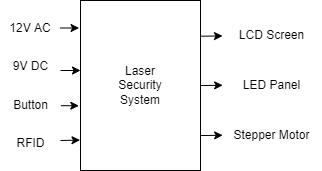
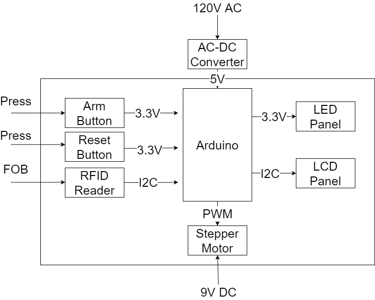

# ECE411 Group 10 - 2022 Fall Practicum Project

## Members
* Jing Ma
* Adam Martinez
* Janvier Mpfizi
* Tysen Tippetts
## Product Design Specifications
[>>HERE<<](PDS/PDS.md)
## Funcitonal Decomposition
### L0

### L1

## Bill of Materials
[Google Sheets Link](https://docs.google.com/spreadsheets/d/1Y6daa6rxvxdisMLShwMxon2ES7SXVknLk-44MzFfnI0/edit?usp=sharing)
### Controllers
- Arduino Uno
### Sensors
- Photoresistors
- RFID Sensor RC522
- Button
### Actuators
- Servo Motor SG90
- LED Lasor 6mm 5mW Red Dot Laser
- LCD Screen 1602 w/ I2C controller
### Misc
- Wires
- RFID Fob
- Resistors
- 3D Printed Enclosure

## Software
- [KiCAD](https://www.kicad.org/) -- Schematic and PCB Layout
- [FreeCAD](https://www.freecadweb.org/) -- 3D Modeling
- [ProjectLibre](https://www.projectlibre.com/) -- Project Management